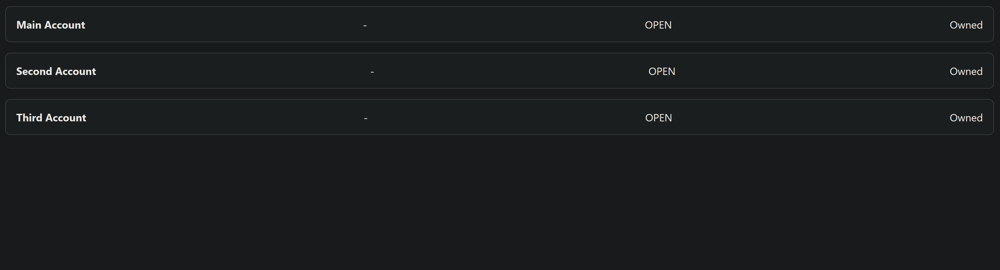

# Insight Assessment

This project demonstrates the development and deployment of a secure, scalable API platform for *Big Purple Bank*, leveraging Azure PaaS, Infrastructure as Code (Bicep), C# .NET API development, automated testing, and a frontend React UI. The key feature is the implementation of the CDS `Get Accounts` endpoint.

---

# Overview 

This project is lacking in a few areas, given the time constraints I have kept it as bare bones as possible while showing core functionality. There are many more features that could be added like proper implimnetation of Azure key vaults, Enviroment variables, etc. The project was developped in Azure Devops and converted to a Git repository.


## 🧭 Introduction

The goal of this project is to:
- Provision Azure infrastructure using Bicep (App Service, SQL DB, Key Vault)
- Implement a standards-compliant `Get Accounts` endpoint based on the [Consumer Data Standards](https://consumerdatastandardsaustralia.github.io/standards/#get-accounts)
- Develop a CI/CD-ready backend in C# .NET
- Write unit tests to ensure reliability
- Create a simple frontend UI using React

---

## ⚙️ Steps Taken

Using Azure Devops

Web API

- Initialise project as .Net Web Api using visual studio
- Download docker desktop
- Impliment API endpoint with test mock data
- Test API with Postman

- Download SQL Server + SSMS
- Use Entity Framework and create Account table

- Setup tests with in memory db context (Moq dbcontext?)

Web App:

- Instanl Node.js 
- Install React

- Create react app with typescript
    - npx create-react-app insight_web
    - npm isntall react-router-dom
    - npm start

    - Not using component library as it is out of scope

- Call Web API getAccounts and map it into a simple box table


CI/CD

Create a Bicep file for creating the azure serverices.

Create azure devops yaml pipeline file for building, running unit tests and deploying the serices with the Bicep file.

---
## ☁️ Infrastructure as Code (Bicep)

### Deployment

Run the following to deploy the infrastructure:

```bash
az login
az group create --name bigpurple-rg --location australiaeast
az deployment group create \
  --resource-group bigpurple-rg \
  --template-file infra/main.bicep \
  --parameters adminPassword=YourP@ssword123!
